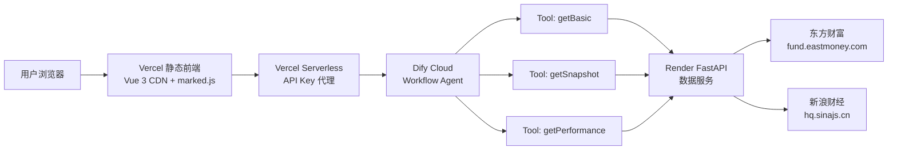

# ETF 对比分析 Agent — 完整实施计划

---

## 总览：5 阶段 / 20 步骤

```
Stage 1 (数据服务)  ████████████████████  5 步 ✅ 已完成
Stage 2 (Dify)      ░░░░░░░░░░░░░░░░░░░░  4 步 ← 当前
Stage 3 (前端)      ░░░░░░░░░░░░░░░░░░░░  4 步
Stage 4 (安全)      ░░░░░░░░░░░░░░░░░░░░  融合在 Stage 3
Stage 5 (文档)      ░░░░░░░░░░░░░░░░░░░░  3 步
```

**实际部署域名**: `https://etf-compare-agent-jba2.vercel.app`  
**部署平台**: Vercel（Serverless Functions），Render 因需要境外信用卡被否决

---

# Stage 1：Python 数据服务 + Vercel 部署 ✅ 已完成

## 1.1 创建项目骨架

| 项目 | 内容 |
|------|------|
| **目的** | 建立最小可运行目录结构，确保依赖清晰 |
| **操作** | 创建 `data-service/` 目录，写 `main.py`（骨架）和 `requirements.txt` |
| **效果** | `uvicorn main:app --reload` 能启动，`/docs` 页面可见 |
| **验收** | 浏览器访问 `http://localhost:8000/docs`，看到 Swagger 页面，3 个端点列出（返回 mock 数据即可） |
| **耗时** | 30 分钟 |

### 文件清单
```
data-service/
├── main.py           # FastAPI 入口
└── requirements.txt  # fastapi, uvicorn, httpx
```

`requirements.txt` 内容：
```
fastapi==0.115.0
uvicorn==0.30.0
httpx==0.27.0
```

---

## 1.2 实现端点 1：`POST /api/etf/basic`

| 项目 | 内容 |
|------|------|
| **目的** | 通过东方财富全量基金列表，获取 ETF 的名称、类型、基金公司等基础信息 |
| **数据源** | `http://fund.eastmoney.com/js/fundcode_search.js` |
| **核心逻辑** | 用 `urllib` 下载 JS 文件 → 解析 `var r = [...]` → 按代码过滤 → 过滤非A股/非权益类 |
| **效果** | POST `{"codes":["510300","159915"]}` 返回每只 ETF 的 name/fund_type/management_company 等 |
| **验收** | Postman 测试，输入 `510300` 返回 "华泰柏瑞沪深300ETF"；输入无效代码 `999999` 返回 error |
| **耗时** | 1.5 小时 |

### 关键边界
- **非 A 股过滤**：恒生/港股/纳斯达克/标普/日经/德国/Vietnam 等关键词
- **非权益类过滤**：货币/债/转债/固收 等关键词，以及 type 为 "货币型"/"债券型"
- **场内 ETF 判定**：51xxxx/56xxxx/58xxxx(sh) + 159xxx/16xxxx(sz)，过滤 519xxx（场外）
- **错误处理**：代码不存在 → `{"error": "invalid_code"}`；接口超时 → `{"error": "timeout", "fallback": true}`

---

## 1.3 实现端点 2：`POST /api/etf/snapshot`

| 项目 | 内容 |
|------|------|
| **目的** | 获取实时行情快照：最新价、涨跌幅、成交量、成交额 |
| **数据源** | `https://hq.sinajs.cn/list=sh510300,sz159915` |
| **核心逻辑** | 代码→新浪符号映射 → 批量请求 → GBK 解码 → 按逗号分割解析 10 个字段 |
| **效果** | POST `{"codes":["510300","159915"]}` 返回每只 ETF 的 price/change_percent/volume 等 |
| **验收** | Postman 测试，返回的 price 与东方财富网页上的实时价一致（允许 15s 延迟）；输入停牌 ETF 返回 null |
| **耗时** | 1 小时 |

### 关键边界
- **编码**：新浪返回是 **GBK**，不是 UTF-8，必须 `.decode("gbk")`
- **Header**：必须带 `Referer: https://finance.sina.com.cn`，否则 403
- **数据校验**（PROJECT_MANUAL 踩坑记录）：
  - `price <= 0.01` → 停牌/退市，返回 null
  - `abs(change_percent) >= 0.30` → A 股 ETF 单日不可能超 ±30%，异常数据返回 null

---

## 1.4 实现端点 3：`POST /api/etf/performance`

| 项目 | 内容 |
|------|------|
| **目的** | 获取近 1 周/1 月/3 月/6 月/1 年的涨跌幅 |
| **数据源** | `http://money.finance.sina.com.cn/quotes_service/api/json_v2.php/CN_MarketData.getKLineData` |
| **核心逻辑** | 请求日 K 线(scale=240, datalen=250) → 取最新收盘价 → 按 5/21/63/126/250 天回推 → 计算收益率 |
| **效果** | POST `{"codes":["510300","159915"]}` 返回每只 ETF 的 `returns: {week1, month1, month3, month6, year1}` |
| **验收** | Postman 测试，`month1` 涨跌幅与东方财富网页上"近1月"数据一致（允许 ±0.5% 误差，因为起止日期算法差异） |
| **耗时** | 1 小时 |

### 关键边界
- **编码**：新浪 K 线接口也是 **GBK**
- **数据不足处理**：如果 K 线数据少于 126 条，`month6` 和 `year1` 返回 null
- **计算方式**：`(latest_close - past_close) / past_close`，保留 6 位小数
- **单个 ETF 独立请求**：K 线接口不支持批量，需逐个请求（手册 427-458 行）

---

## 1.5 Vercel 部署

| 项目 | 内容 |
|------|------|
| **目的** | 把数据服务部署到公网，让 Dify 能通过 HTTPS 调用 |
| **操作** | GitHub 推送代码 → Vercel import 仓库 → 自动部署（零配置） |
| **效果** | 获得 `https://etf-compare-agent-jba2.vercel.app` 域名，3 个端点公网可访问 |
| **注意** | Render 因需要境外信用卡被否决，改用 Vercel Serverless Functions（Python） |

### 架构调整

```
原计划: FastAPI → Render Web Service
实际部署: Python Serverless Functions → Vercel

api/etf/_shared.py        # 共享数据抓取逻辑
api/etf/basic.py          # → /api/etf/basic
api/etf/snapshot.py       # → /api/etf/snapshot
api/etf/performance.py    # → /api/etf/performance（并发请求，适配 10s 超时）
```

### 部署验证结果（2026-08-05）

| 端点 | 状态 | 响应时间 | 验证数据 |
|------|------|---------|---------|
| basic | 200 | 5.7s（含冷启动） | 510300→沪深300ETF华泰柏瑞, 948.72亿, 大盘蓝筹 |
| snapshot | 200 | 3.4s | 510300→¥4.726, +1.61% |
| performance | 200 | 3.7s | 510300→1周+0.52%, 1月-4.63%, 3月-4.85% |

**Dify Tool URL 配置（Stage 2 使用）**：
- basic: `POST https://etf-compare-agent-jba2.vercel.app/api/etf/basic`
- snapshot: `POST https://etf-compare-agent-jba2.vercel.app/api/etf/snapshot`
- performance: `POST https://etf-compare-agent-jba2.vercel.app/api/etf/performance`

所有端点 Body: `{"codes": ["510300", "159915"]}`


---

# Stage 2：Dify Workflow 搭建

## 2.1 创建 Workflow + 开始节点

| 项目 | 内容 |
|------|------|
| **目的** | 在 Dify Cloud 创建应用，定义输入 |
| **操作** | 注册 cloud.dify.ai → 创建 Workflow 应用 → 开始节点设 `codes: string` |
| **效果** | 应用可接收逗号分隔的 ETF 代码字符串 |
| **验收** | 在 Dify 预览面板输入 `510300,159915`，能看到开始节点成功接收 |
| **耗时** | 20 分钟 |

---

## 2.2 Code 节点 #1：输入清洗

| 项目 | 内容 |
|------|------|
| **目的** | 脏输入 → 干净数组，防御用户手滑 |
| **逻辑** | ① `split(",")` ② trim 空格 ③ 去重 ④ 校验 6 位数字 ⑤ 截断到 5 只 |
| **效果** | 输入 `"510300, 159915, 510300, 999,1234567890"` → 输出 `["510300","159915"]` |
| **验收** | 分别测：带空格/重复/超5只/无效代码/空输入，每次都输出干净的 cleaned_codes 数组 |
| **耗时** | 30 分钟 |

### Dify Code 节点代码（Python 沙箱）
```python
def main(codes: str):
    if not codes or not codes.strip():
        return {"cleaned_codes": [], "warning": "未输入代码"}
    
    raw = [c.strip() for c in codes.split(",") if c.strip()]
    seen = set()
    valid = []
    
    for c in raw:
        if c in seen:
            continue
        if len(c) == 6 and c.isdigit():
            seen.add(c)
            valid.append(c)
    
    if len(valid) > 5:
        valid = valid[:5]
    
    warning = None
    if len(raw) > 5:
        warning = f"最多对比5只ETF，已截取前5只"
    if len(valid) < len(raw):
        warning = warning or "部分代码无效，已过滤"
    
    return {"cleaned_codes": valid, "warning": warning}
```

---

## 2.3 3 个 HTTP Tool 并行调用

| 项目 | 内容 |
|------|------|
| **目的** | 3 个维度数据并行获取，不让用户等串行 |
| **操作** | 在 Dify「工具」创建 3 个自定义 API Tool → 在 Workflow 画布上拖 3 个 Tool 节点 → 并行连线 |
| **效果** | 一次请求同时打 basic/snapshot/performance 三个端点 |
| **验收** | 在日志中看到 3 个 Tool **同时开始执行**（时间戳几乎相同），而非串行 |
| **耗时** | 1.5 小时 |

### 3 个 Tool 配置

| Tool | URL | Timeout |
|------|-----|---------|
| getBasic | `POST https://xxx.onrender.com/api/etf/basic` | 45s |
| getSnapshot | `POST https://xxx.onrender.com/api/etf/snapshot` | 30s |
| getPerformance | `POST https://xxx.onrender.com/api/etf/performance` | 60s |

### 关键点
- Performance Tool 超时设 60s 是因为它内部逐个请求 K 线
- Body 传 `{"codes": "{{#1.cleaned_codes}}"}`

---

## 2.4 Code 节点 #2 + LLM 节点

| 项目 | 内容 |
|------|------|
| **目的** | 聚合 3 个 Tool 的结果 → 构建结构化对比矩阵 → LLM 生成报告 |
| **操作** | Code 节点 #2 合并数据、标记缺失维度 → LLM 节点配 System Prompt |
| **效果** | 输入 2-5 个 ETF 代码，输出完整的结构化对比报告 |
| **验收** | 完整链路测试：输入 `510300,159915` → 等待 15-60 秒 → 输出包含"对比总览表格 + 逐只解读 + 维度总结 + 注意事项"的 Markdown 报告 |
| **耗时** | 2 小时 |

### LLM 节点配置
- **Model**: `deepseek-v4-flash`（Dify 市场安装）
- **Temperature**: `0.3`
- **Max tokens**: `3000`
- **额外参数（JSON）**: `{"thinking": {"type": "disabled"}}`

**System Prompt**（完整版）：
```
你是一个专业的 ETF 对比分析助手。你的任务是基于真实数据，帮用户对比多只 ETF 的核心维度差异。

## 行为准则

1. 禁止提供投资建议。不说"建议买入"、"推荐持有"、"这只更好"等结论性判断
2. 禁止编造数据。只基于提供的真实数据，缺失数据标注"暂无数据"
3. 必须用白话解释专业术语。如出现"跟踪误差"、"折溢价"、"夏普比率"等，要加简短解释
4. 底部必须标注："数据来源：新浪财经 / 东方财富公开数据，延迟约 15-30 分钟，仅供参考"
5. 结构化输出，格式见下方
6. 最多对比 5 只 ETF。如果输入超过 5 只，在报告中提示并仅展示前 5 只

## 输出格式

### 对比总览

用 Markdown 表格列出以下维度的对比：

| 维度 | ETF1(代码-名称) | ETF2(代码-名称) | ... |
|------|----------------|-----------------|-----|
| 跟踪指数 | xxx | xxx | |
| 基金规模 | xxx亿元 | xxx亿元 | |
| 管理费率 | 0.xx% | 0.xx% | |
| 成立时间 | xxxx年 | xxxx年 | |
| 今日涨跌 | +x.xx% | -x.xx% | |
| 近1月收益 | +x.xx% | +x.xx% | |
| 近3月收益 | +x.xx% | +x.xx% | |
| 行业分类 | xxx | xxx | |

### 逐只解读

每只 ETF 一段话（不超过 5 行），用白话说明：
- 它跟踪什么指数
- 规模意味着什么（规模大 = 流动性好）
- 费率高低对长期持有的影响
- 近期表现简述

### 维度对比总结

选择差异最大的 2-3 个维度做深入对比，解释差异的含义。

### 注意事项

提醒用户：
- 历史业绩不代表未来表现
- 费率、规模、跟踪误差是选 ETF 的核心维度
- 不同 ETF 可能跟踪同一指数，主要看费率和规模

---
数据来源：新浪财经 / 东方财富公开数据，延迟约 15-30 分钟，仅供参考。不构成投资建议。
```

### Code 节点 #2 核心逻辑
```python
def main(basic: dict, snapshot: dict, performance: dict, cleaned_codes: list, warning: str):
    # 1. 按 code 合并三个结果
    # 2. 标记缺失：如果某个 Tool 返回 null/error → 该维度标 "暂无数据"
    # 3. 识别差异最大的 2-3 个维度（如：费率差 > 0.3%、近3月收益差 > 5%）
    # 4. 输出结构化矩阵给 LLM
    result = {
        "codes": cleaned_codes,
        "warning": warning,
        "data": {}
    }
    
    for code in cleaned_codes:
        entry = {
            "code": code,
            "basic": basic.get(code) if basic else None,
            "snapshot": snapshot.get(code) if snapshot else None,
            "performance": performance.get(code) if performance else None,
        }
        result["data"][code] = entry
    
    # 统计可用维度
    basic_ok = sum(1 for c in cleaned_codes if result["data"][c]["basic"])
    snapshot_ok = sum(1 for c in cleaned_codes if result["data"][c]["snapshot"])
    perf_ok = sum(1 for c in cleaned_codes if result["data"][c]["performance"])
    
    result["summary"] = {
        "basic_available": basic_ok,
        "snapshot_available": snapshot_ok,
        "performance_available": perf_ok,
    }
    
    return {"comparison_matrix": str(result)}
```

### 错误处理策略（在 Agent 中配置）

| 场景 | Agent 行为 |
|------|-----------|
| 全部 3 个 Tool 成功 | 正常生成完整报告 |
| 1 个 Tool 失败/超时 | 跳过该维度，报告中标注"该维度数据暂不可用" |
| 2 个 Tool 失败 | 用仅剩的数据生成精简版对比 |
| 全部 Tool 失败 | 输出"当前数据服务暂不可用，请稍后重试" |
| 用户输入无效代码 | Code 节点#1 校验后返回空数组 → LLM 输出"未找到有效 ETF 代码，请检查后重试" |

---

# Stage 3：极简前端 + Vercel 部署

## 3.1 单文件 `index.html`

| 项目 | 内容 |
|------|------|
| **目的** | 给用户一个可直接用的网页界面，不需要进 Dify 后台 |
| **技术** | Vue 3 CDN + marked.js CDN + 原生 CSS，单文件，零构建 |
| **效果** | 输入框 + 对比按钮 + Markdown 渲染结果区 |
| **验收** | 打开 `index.html`，输入 `510300,159915`，点击"开始对比"，等待后看到格式化的对比报告 |
| **耗时** | 2 小时 |

### 页面要素
- 输入框 + "开始对比"按钮
- 示例代码快捷填入
- Loading 状态（等待中显示动画）
- Markdown 渲染结果区（marked.js）
- 底部固定文案："数据延迟约 15-30 分钟，仅供参考"
- 错误提示（网络异常/超时/Dify 不可用）

---

## 3.2 Vercel Serverless Function（`api/compare.js`）

| 项目 | 内容 |
|------|------|
| **目的** | 代理 Dify API Key，前端不暴露密钥 |
| **操作** | 创建 `api/compare.js`，用 Node.js fetch 转发到 Dify Workflow API |
| **效果** | 前端调 `/api/compare`，Serverless 内部拼 DIFY_API_KEY 环境变量 |
| **验收** | 浏览器 Network 面板看不到任何 Dify API Key；同时接口正常返回数据 |
| **耗时** | 1 小时 |

### 完整代码
```javascript
export default async function handler(req, res) {
  if (req.method !== 'POST') {
    return res.status(405).json({ error: 'Method not allowed' });
  }

  const { codes } = req.body;
  if (!codes || typeof codes !== 'string' || !codes.trim()) {
    return res.status(400).json({ error: '请提供 ETF 代码' });
  }

  try {
    const response = await fetch('https://udify.app/api/workflows/run', {
      method: 'POST',
      headers: {
        'Authorization': `Bearer ${process.env.DIFY_API_KEY}`,
        'Content-Type': 'application/json',
      },
      body: JSON.stringify({
        inputs: { codes: codes.trim() },
        response_mode: 'blocking',
        user: 'anonymous',
      }),
    });

    if (!response.ok) {
      return res.status(502).json({ error: `Dify API error: ${response.status}` });
    }

    const data = await response.json();
    // Dify Workflow 返回格式: { data: { outputs: { report: "..." } } }
    const report = data?.data?.outputs?.report || data?.data?.outputs?.text || '暂无分析结果';
    return res.json({ report });
  } catch (err) {
    return res.status(500).json({ error: '比对服务暂时不可用，请稍后重试' });
  }
}
```

---

## 3.3 Vercel 部署

| 项目 | 内容 |
|------|------|
| **目的** | 把 frontend + serverless function 部署到公网 |
| **操作** | 创建 `vercel.json` → 配环境变量 `DIFY_API_KEY` → `vercel deploy` |
| **效果** | 获得 `https://etf-compare.vercel.app` 域名 |
| **验收** | 手机/电脑浏览器访问，输入代码，拿到完整对比报告 |
| **耗时** | 30 分钟 |

### Vercel 配置（`vercel.json`）
```json
{
  "functions": {
    "api/compare.js": {
      "runtime": "@vercel/node"
    }
  }
}
```

### 环境变量
在 Vercel 项目 Settings → Environment Variables 中添加：
- Key: `DIFY_API_KEY`
- Value: `app-xxxxxxxxxxxxxx`（Dify 后台 → 应用 → API 访问 → API 密钥）

### 部署命令
```bash
npm i -g vercel   # 一次性
vercel            # 在项目根目录执行
```

### 部署后验证清单
- [ ] 桌面端 Chrome 正常
- [ ] 手机端 Safari 正常
- [ ] 输入无效代码 → 显示错误提示
- [ ] Network 面板无 Dify API Key 泄漏
- [ ] 首次冷启动（Render 休眠）→ 等待 30 秒后仍能出结果

---

## 3.4 边界测试

| 项目 | 内容 |
|------|------|
| **目的** | 确保各种异常场景不崩 |
| **操作** | 逐一验证错误处理矩阵 |
| **验收** | 所有场景 UI 都不白屏，都有用户可理解的提示 |

### 测试用例

| 场景 | 期望结果 |
|------|---------|
| 输入 `510300,159915` | 正常报告 |
| 输入 `510300, 159915, 510300` | 去重，只比 2 只 |
| 输入 `999999` | "未找到有效 ETF 代码" |
| 输入空字符串 | "请输入 ETF 代码" |
| 输入 7 个代码 | 截取前 5 只，提示"已截取" |
| Render 服务休眠 | 等待冷启动，约 30-45 秒后出结果 |

---

# Stage 5：文档 + Git 交付

## 5.1 补充 Git 仓库文件

| 项目 | 内容 |
|------|------|
| **目的** | 让面试官/协作者能快速理解项目 |
| **操作** | 写 README.md、PRD.md、`.gitignore`、Dify 导出文件 |
| **验收** | 一个陌生人看完 README 能理解：这项目做什么、为什么用 Agent、怎么跑起来 |
| **耗时** | 1 小时 |

---

## 5.2 README.md

| 章节 | 必须包含 |
|------|---------|
| 项目简介 | 一句话说清楚做什么 |
| 为什么做 | 从 ETF 工具需求缺口引出 |
| 为什么用 Agent | 并行 Tool vs 单次 LLM 对比说明 |
| 架构图 | Mermaid flowchart |
| 快速体验 | Dify 公开链接 + Vercel 网页链接 |
| 技术选型 | Dify Cloud / Render / Vercel / FastAPI / DeepSeek V4 |
| 本地开发 | `pip install -r requirements.txt && uvicorn main:app --reload` |
| API 文档 | 3 个端点说明（请求/响应示例） |
| 部署指南 | Render / Vercel / Dify 部署步骤 |

### Mermaid 架构图


---

## 5.3 Dify Workflow 导出 + 截图

| 项目 | 内容 |
|------|------|
| **目的** | 让项目完整可复现，面试时可直接展示 |
| **操作** | Dify 后台导出 DSL → 放 `dify/workflow-dsl.yml`；截图 Workflow 画布拓扑 |
| **验收** | 其他人可以导入 DSL 重建同一个 Workflow |

---

## Git 仓库最终结构

```
etf-compare-agent/
├── data-service/
│   ├── main.py              # FastAPI 入口，3 端点
│   ├── requirements.txt     # fastapi, uvicorn, httpx
│   └── README.md            # API 接口文档
├── dify/
│   ├── workflow-dsl.yml     # Dify Workflow 导出文件
│   └── README.md            # Dify 配置说明（Tool 配置 + Prompt + 截图）
├── frontend/
│   └── index.html           # 极简前端单页
├── api/
│   └── compare.js           # Vercel Serverless Function
├── vercel.json              # Vercel 部署配置
├── README.md                # 项目总览
├── PROJECT_MANUAL.md        # 完整项目手册
├── IMPLEMENTATION_PLAN.md   # 本文件：实施计划
├── docs/
│   └── PRD.md               # 产品需求文档
└── .gitignore
```

### `.gitignore` 内容
```
__pycache__/
*.pyc
.env
.env.local
node_modules/
.vercel
```

---

# 总时间轴

```
Day 1（6-8h）
  上午：1.1 骨架 + 1.2 basic 端点 + 1.3 snapshot 端点
  下午：1.4 performance 端点 + 1.5 Render 部署

Day 2（6-8h）
  上午：2.1~2.3 Dify Workflow 搭建 + 3 个 Tool 配置
  下午：2.4 聚合 + LLM + 全链路调试

Day 3（5-6h）
  上午：3.1~3.3 前端 + Serverless + Vercel 部署
  下午：3.4 边界测试 + 5.1~5.3 文档 + Git 整理
```

---

# 关键风险与对策

| 风险 | 概率 | 对策 |
|------|------|------|
| Render 免费版冷启动 >45s，Dify Tool 超时 | 中 | 部署后用 UptimeRobot 每 14 分钟 ping 一次，避免休眠 |
| 东方财富 `fundcode_search.js` 接口格式变更 | 低 | basic 端点有 fallback：从代码前缀推断交易所和名称 |
| 新浪 K 线接口限流 | 低 | 单次最多 5 只 × 1 请求，远低于限流阈值 |
| DeepSeek V4 `thinking` 开关失效导致空输出 | 中 | PROJECT_MANUAL 已踩过坑，LLM 节点必须加 `{"thinking":{"type":"disabled"}}` |
| Dify 免费版 200 次/月不够 | 低 | 面试演示用，实际调用极少 |

---

*计划生成时间：2026-08-05*
