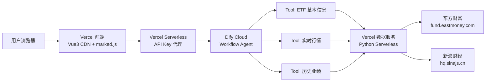

# ETF 对比分析助手

> 输入 2-5 只 ETF 代码，并行查询基本面、实时行情、历史业绩，生成结构化对比报告。
>
> 与 [ETF 持仓解释工具](https://github.com/djk2026/etf-holdings) 互补——前者"看懂持仓"，本项目"对比选哪只"。

---

## 为什么用 Agent

单次 LLM 调用无法同时查询多只 ETF 的多维度数据。Dify Workflow Agent 的并行 Tool 节点是天然解法：

- **3 个 Tool 并行调用**：基本信息 / 实时行情 / 历史业绩同时获取，不串行等待
- **LLM 只负责推理**：数据聚合清洗由 Code 节点完成，LLM 专注生成对比报告
- **结构化约束**：System Prompt 强制表格 + 逐只解读 + 维度总结格式

---

## 架构



| 层 | 技术 | 部署 | 说明 |
|---|------|------|------|
| 前端 | Vue 3 CDN + marked.js | Vercel Static | 单文件 `index.html`，零构建 |
| API 代理 | Node.js Serverless | Vercel Functions | 隐藏 Dify API Key |
| Agent 编排 | Dify Workflow | Dify Cloud | 6 节点：开始→清洗→3Tool并行→聚合→LLM→结束 |
| 数据服务 | Python Serverless | Vercel Functions | 3 个端点，零依赖（仅 `urllib`） |
| 数据源 | 新浪财经 / 东方财富 | 公开接口 | GBK 编码，需 Referer |

---

## 快速体验

| 方式 | 链接 |
|------|------|
| **网页版** | [https://etf-compare-agent-jba2.vercel.app](https://etf-compare-agent-jba2.vercel.app) |
| **数据服务 API** | `POST https://etf-compare-agent-jba2.vercel.app/api/etf/{basic,snapshot,performance}` |

示例输入：`510300,159915,588000`

---

## 项目结构

```
etf-compare-agent/
├── index.html                  # 前端：Vue3 CDN + marked.js 单文件
├── api/
│   ├── compare.js              # Vercel Serverless：Dify API Key 代理
│   └── etf/
│       ├── _shared.py          # 共享：东方财富/新浪抓取逻辑
│       ├── basic.py            # → /api/etf/basic
│       ├── snapshot.py         # → /api/etf/snapshot
│       └── performance.py      # → /api/etf/performance（并发K线）
├── data-service/               # 本地开发用 FastAPI（保留）
│   ├── main.py
│   ├── shared.py
│   └── requirements.txt
├── PROJECT_MANUAL.md           # 完整项目手册（需求/架构/Prompt/踩坑）
├── IMPLEMENTATION_PLAN.md      # 实施计划（20 步可验收）
└── .gitignore
```

---

## Dify Workflow 拓扑

```
开始(用户输入codes)
  → Code节点#1: 清洗+校验(去空格/去重/限5只)
  → 3个HTTP节点并行:
      ├── POST /api/etf/basic      (东方财富基金列表)
      ├── POST /api/etf/snapshot   (新浪实时行情)
      └── POST /api/etf/performance (新浪K线计算)
  → Code节点#2: 数据聚合+构建对比矩阵
  → LLM节点(DeepSeek-V4): 生成结构化报告
  → 结束
```

---

## 数据服务 API

所有端点 POST，Body：`{"codes": ["510300", "159915"]}`

| 端点 | 数据 | 数据源 |
|------|------|--------|
| `/api/etf/basic` | 名称、规模、费率、跟踪指数、行业分类 | 东方财富 `fundcode_search.js` |
| `/api/etf/snapshot` | 最新价、涨跌幅、成交额、折溢价 | 新浪 `hq.sinajs.cn` |
| `/api/etf/performance` | 1周/1月/3月/6月/1年涨跌幅 | 新浪 K 线接口 |

---

## 技术选型

| 技术 | 选型 | 理由 |
|------|------|------|
| Agent 编排 | Dify Cloud | 免费层足够，可视化 Workflow，适合演示 |
| LLM | DeepSeek-V4 | 性价比高，中文能力强 |
| 数据服务 | Python (urllib) | 零依赖，Vercel Serverless 原生支持 |
| 前端 | Vue 3 CDN + marked.js | 单文件，零构建，部署即用 |
| 部署 | Vercel | 免费，免信用卡，Git push 自动部署 |

---

## 本地开发

```bash
# 数据服务（FastAPI 版，端口 8001，避免与 ETF 持仓工具冲突）
cd data-service
pip install -r requirements.txt
uvicorn main:app --reload --port 8001
# 访问 http://localhost:8001/docs 查看 Swagger

# Vercel 版（本地模拟）
npm i -g vercel
vercel dev
```

---

## 部署

```bash
# 1. 推送到 GitHub
git push

# 2. Vercel 自动部署
# 3. 设置环境变量：DIFY_API_KEY = app-xxxxxxxxxxxxxx
# 4. Dify 导出 Workflow DSL
```

---

## 行为准则（LLM System Prompt 约束）

1. 禁止投资建议（不说"推荐买入""建议持有"）
2. 禁止编造数据（缺失标注"暂无数据"）
3. 白话翻译专业术语
4. 底部标注数据延迟 15-30 分钟
5. 结构化输出：对比表格 + 逐只解读 + 维度总结
6. 最多对比 5 只

---

## 许可

MIT License
